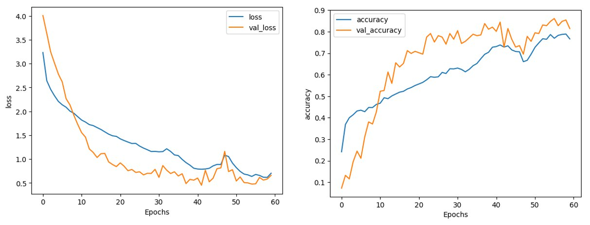
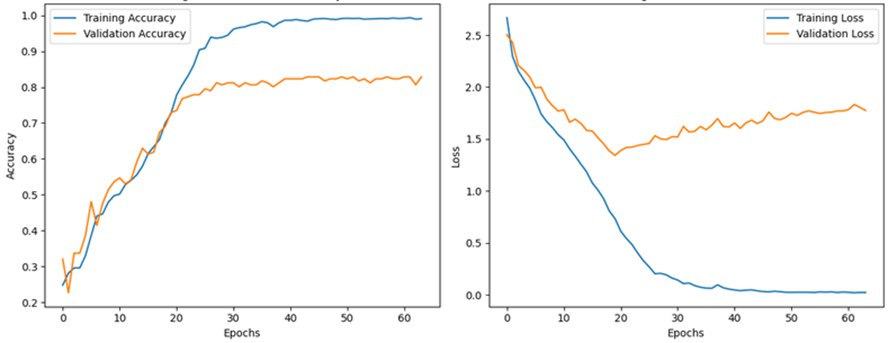

# Выпускная квалификационная работа магистра
## на тему: Создание приложения для формирования макросов и блоков на основе пользовательских логов в САПР с применением методов машинного обучения
### Лагуткина Мария Сергеевна, группа М8О-209М-23
------
Проект состоит из двух модулей: модуля нейронных сетей и графического интерфейса.
**
Стек технологий: ** Python, TensorFlow + Keras, Qt, C++, Cmake, NanoCAD API, Git
------
## Модуль нейронных сетей
Состоит из:
1. двух Jupiter notebook
2. токенизатора
3. трех обученных моделей
4. Python-скриптов для запуска моделей.

#### Полученные метрики:
1. Для предсказания следующей команды пользователя
   
2. Для предсказания макросов и блоков

   
## Графический интерфейс
Для того, чтобы собрать приложение, нужно установить nanoCAD SDK, cmake и Qt.
Консольная генерация проекта по Visual Studio 2022:
```
mkdir build
cd build
cmake -DNCadSDK="path_to_sdk/sdk25" -DQt5_DIR="path_to_qt/Qt/5.15.16/msvc2019_64/lib/cmake/Qt5" ..
```
